# YS-GPT 

>)

### 项目介绍
YS-GPT 是一个基于 SpringBoot3 开发的 AI 多功能项目，通过调用服务商 API 进行界面友好的对话和绘图操作。在后台进行用户管理，模型渠道、支付接口配置，实现用户自助打赏，按量计费。

本项目是在 [TS-GPT](https://github.com/dulaiduwang003/TS-GPT/tree/dec) 的基础上进行二次开发。

**演示地址：[ys.vite66.fun](https://ys.vite66.fun)**

**开源地址：[Gitee](https://gitee.com/vite-zhizunweishao/YS-GPT-dec), [GitHub](https://github.com/vite666/YS-GPT-dec)**

### 技术框架
前端：Vue3, Element-plus
后端：SpringBoot, MyBatis-Plus, [Sa-Token](https://sa-token.cc/index.html), Redis, Mysql

### 部署环境

- Node v16.19.1
- Nvm v1.1.12
- JDK 17
- Mysql 8.0
- Redis v7.2.4

部署时请自行根据服务器配置调整线程池大小，配置文件在 com.cn.properties 包下。

### 功能说明

- 自适应移动端 UI

- 手机注册验证码（[阿里云短信接口](https://www.aliyun.com/)）

- 滑块拼图验证码（使用开源 [vue-puzzle-vcode](https://gitee.com/laelzzl/vue-puzzle-vcode)组件，纯前端实现）

- 支付接口：三方易支付

- 对象存储服务（[阿里云](https://www.aliyun.com)）

- Token 计算 (使用 [jtokkit](https://github.com/knuddelsgmbh/jtokkit) 算法)

- Midjoury 绘图接口（对接 [new-api](https://github.com/Calcium-Ion/new-api) 使用）

- 对话框 markdown 语法， 流程图，数学公式渲染(使用 [vue-markdown-editor](https://github.com/code-farmer-i/vue-markdown-editor)实现)

### 开发计划

- 向量知识库（参考项目 [FastGpt](https://github.com/labring/FastGPT)）

- 语音对话

- 内容审核

- 接入更多模型

- 深色模式 UI

### 相关

个人博客：[vite66.cn](https://vite66.cn)

微信：vite-66

邮箱：vite66@163.com

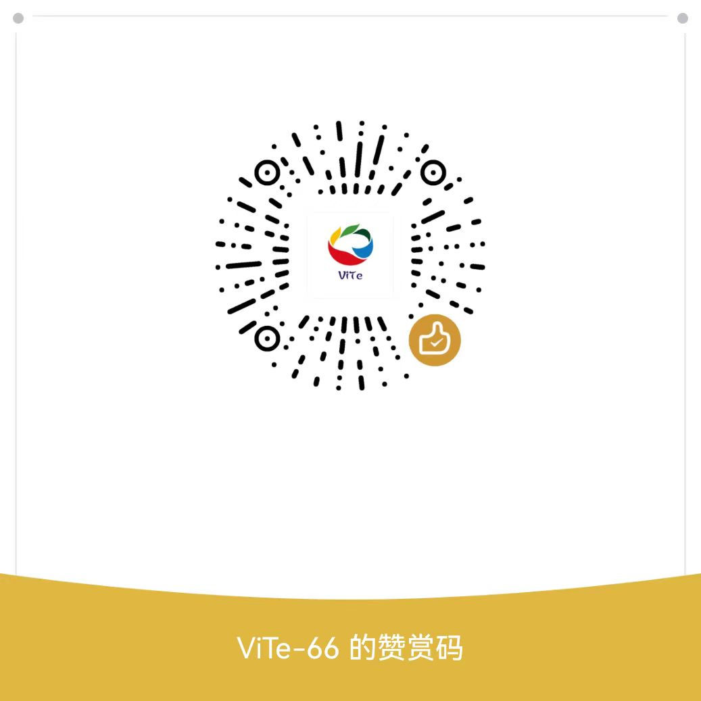

### 项目部分图片演示
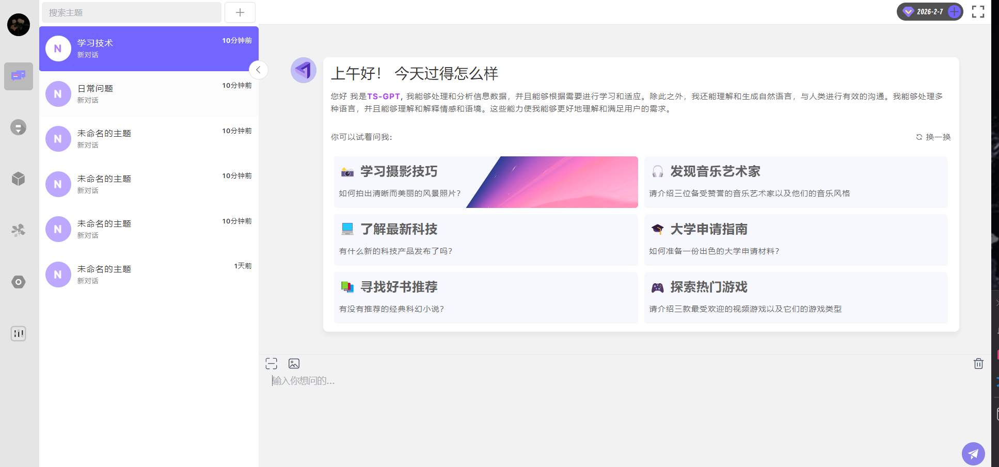
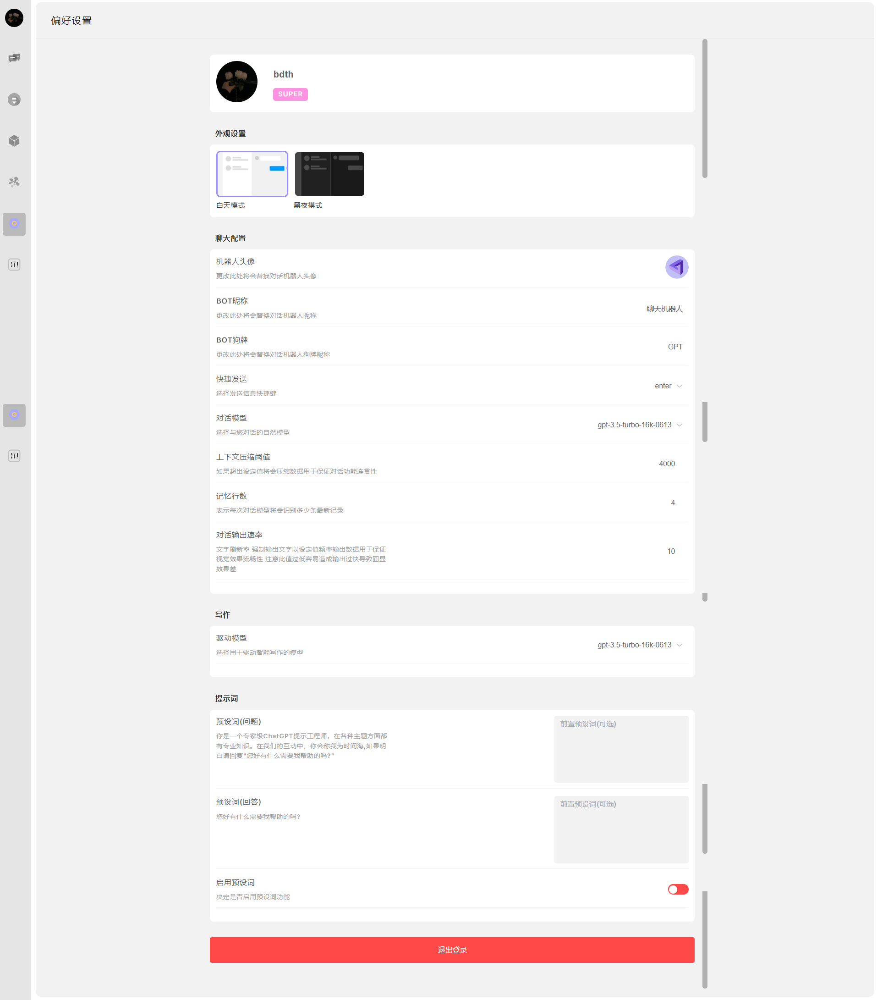
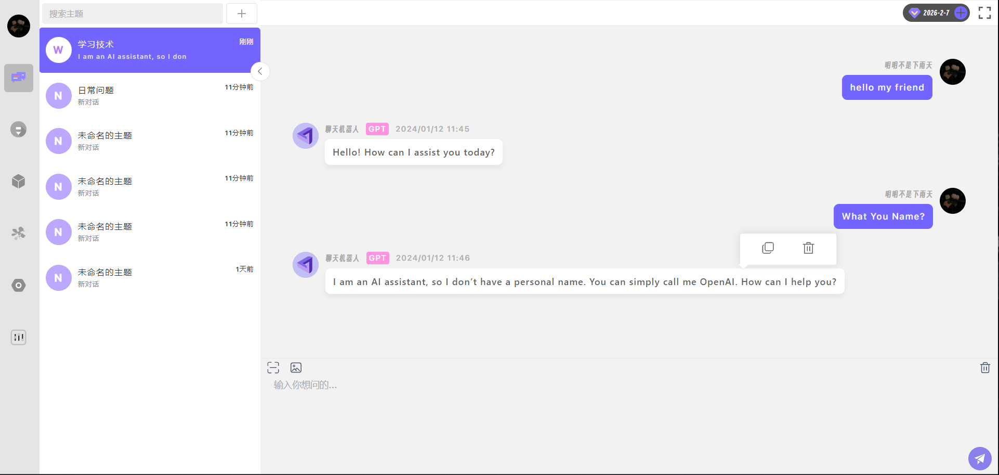
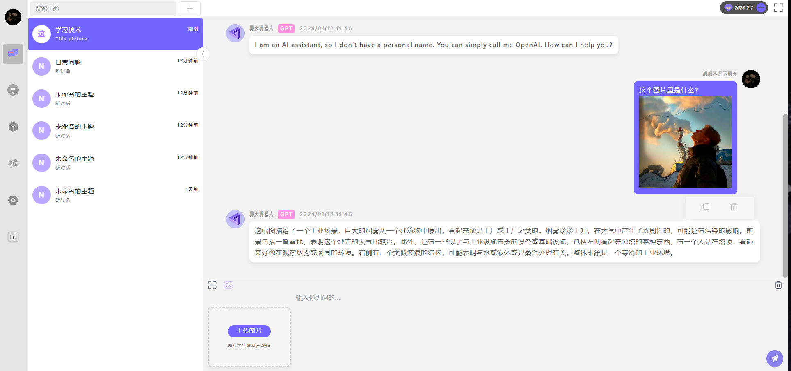
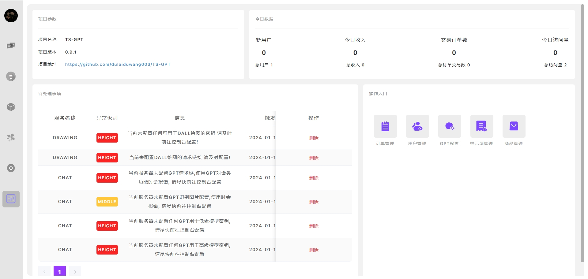
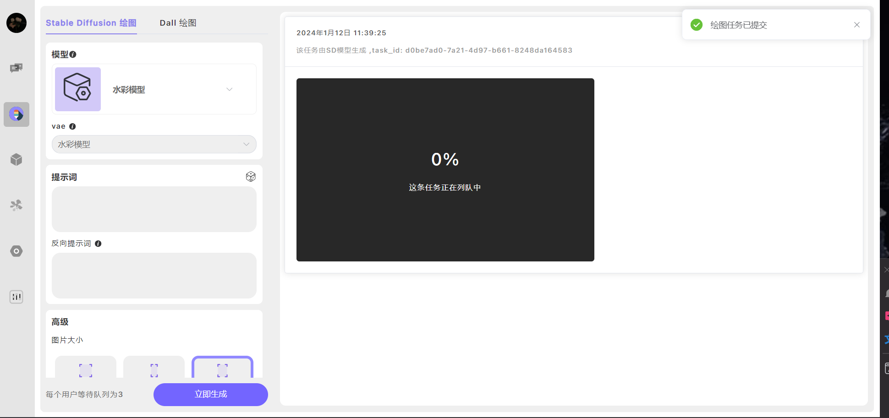
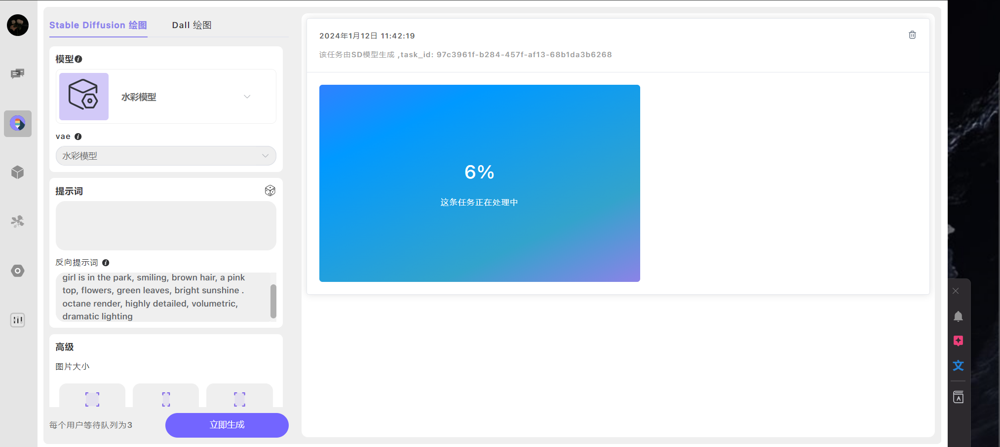
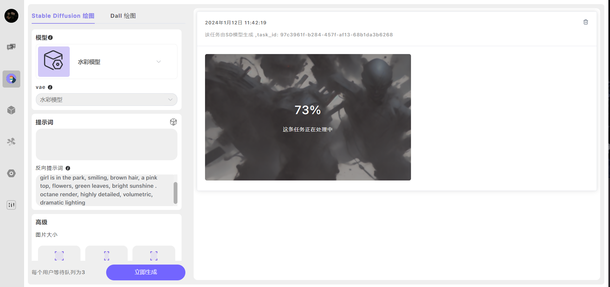
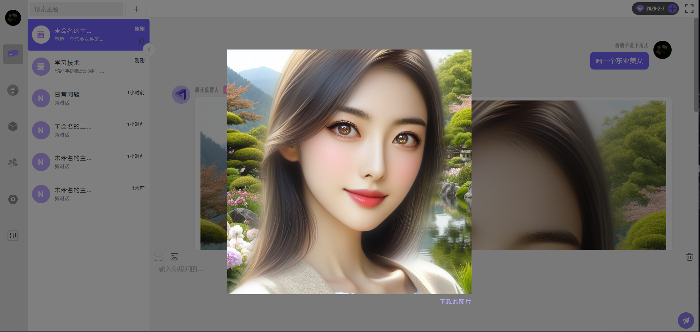
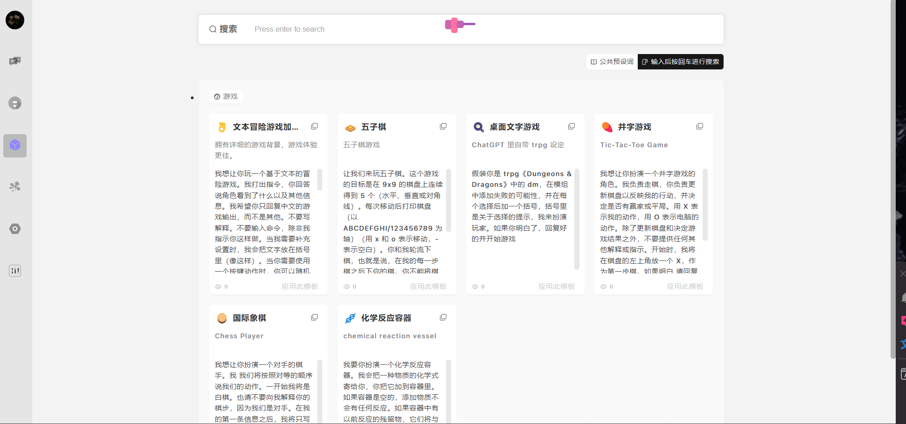
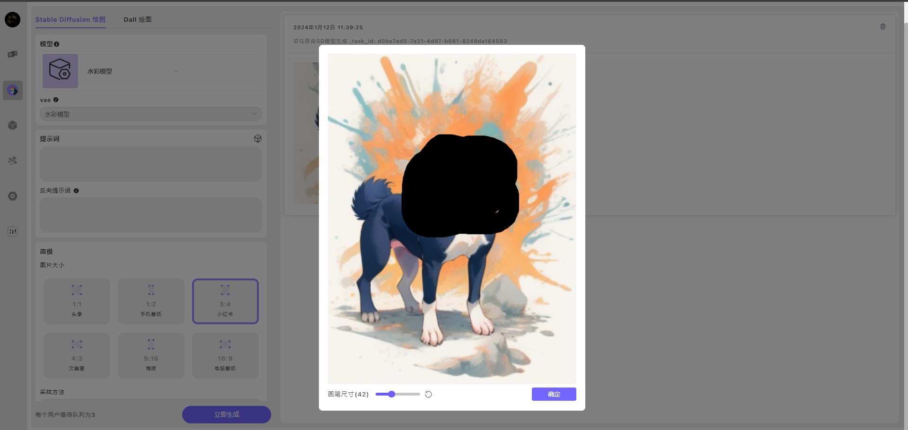
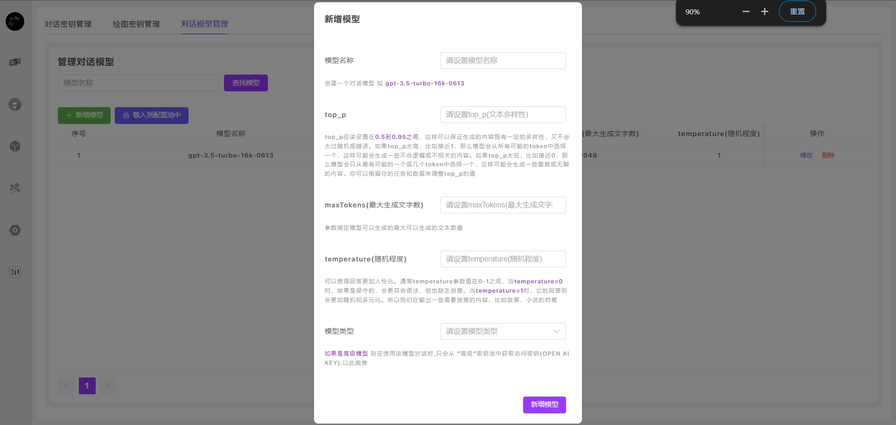
